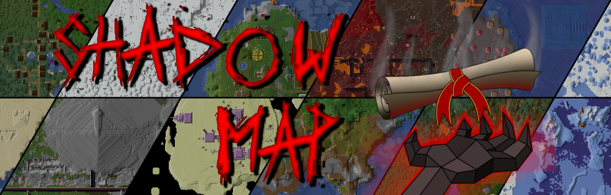

# 

Salutations, The Internet! It's finally time for the long-overdue release of ShadowMap! A mapping tool for Minecraft
with a healthy dose of over-engineering and a few extra niceties for those of us that like to tinker.
This project started over 5 years ago as a 1.12 core-mod using MCP, but as times have changed and fabric/mixins have
gotten better, I'm overdue to update, and this time I'm making the source available too!

### ! BETA RELEASE NOTICE !

ShadowMap is still early in its development. Changes will be made, features will be added. What doesn't work now will
work later. What works now will work well later. What works well now will be inexplicably broken later. It's a process
:)

### See the [Mini-Guide](#mini-guide) below for installation and usage.
### Download the latest version from [Releases](https://github.com/caucow/ShadowMap/releases).
### See the [Probably-Asked-Questions](#probably-asked-questions) for cheeky commentary.

## Current Features

- It maps things!
  - A top-down view of the world that works in cave dimensions such as the Nether.
  - Three block layers - liquid, transparent, and solid - for a nearly-realistic map without sacrificing too much
    performance or memory.
  - See *ALL* chunks your game sees, even the ones *you* can't. For technical reasons, biomes can't be rendered properly
    in edge chunks. ShadowMap still draws these, but you'll see tinted blocks like grass and water in gray. *This is
    intentional, more information for you!*
  - **Multi-Instance Support** - Created from the beginning with [Nerds Like Me(tm) that use multiple accounts on the
    same server] in mind. Your map files will be kept up to date with the latest world state. The technical term for the
    current implementation is "eventually consistent."
- Waypoints, but actually good!
  - All the familiar bits you'd expect including name, position, color, abbreviation, and visibility.
  - Deathpoints for those of us that tend to un-alive frequently.
  - Waypoint GROUPS and sub-groups. Decide for yourself how much clutter you want on your screen with more granularity
    than all-or-nothing. And yes, deathpoints are automatically grouped.
  - Per-waypoint "filters" to automatically show/hide waypoints and expand/collapse groups based on distance. Labeling
    every house in town doesn't have to fill your screen with garbled text!
- *It go fast!(\*)*
  - Map generation begins as soon as your game loads a chunk, no more cheese-grater mapping while flying with an elytra.
  - I was only trying for "not super slow," but ended up with something that loads over 5 times faster than Xaero's, *in
    the lowest performance mode* (\*performance settings not available during initial release, will be added soon!).
    - *\*Xaero's has map image caching which technically shows up faster. When changing resource packs or clearing the
      cache, ShadowMap is faster. This will be remedied soon(tm).*
- An API for nerds that care about that sort of thing.
  - Draw extra details on the map, handle fullscreen map user inputs, ~~add custom renderers,~~ and store custom data in
    map chunks. I wanted something *I* can easily extend, I'm sure I can't be the only one.
  - Fairly basic at the moment but more features will be exposed as I add them and internal code stabilizes.
  - **Expect the API to be fairly unstable during the beta release period.** I'm trying to future~~-proof~~-predict
    use cases and useful API access methods, but can only do so much to get it out ASAP after 1.20's release. What
    exists now shouldn't change much, but I can't guarantee anything. Some planned features will not be available during
    beta.

## Upcoming and Planned - Features and Changes

- ***REALMS SUPPORT***: Due to my refusal to buy a Realm for testing at this point in time, Realms mapping likely
  doesn't work. 
  ***If anyone has a Realm they don't mind inviting me to, reach out on Discord or GitHub!***  
- ***Soon(tm)***: Cursor-centric fullscreen map - Currently, the center of the screen is the focal point of the map (for
  loading regions).
- ***Soon(tm)***: More configuration, more user-friendly menus - As more features are added, this will also be improved,
  including more map rendering options.
- ***Soon(tm)***: An update checker - So that you won't miss out on my latest "oops" moments. I'll try to make it not
  obnoxious. *\*cough\* DO YOU HAVE A MOMENT TO TALK ABOUT OUR LORD AND SAVIOUR, **CURRENT(DOT)MAP(DOT)VERSION+0.0.1**?*
- ***Soon(tm)***: Fullscreen map performance and memory usage improvements - Right now the fullscreen map is a memory
  hog once you zoom out far enough.
- *Upcoming*: Proper waypoint coords censoring. This basically requires a full-custom text-field rewrite unless I can
  find a good gui library that supports censor characters.
- *Upcoming*: Multi-level map image caching - For even faster-er load times and more insane zoom levels (I want 1/512x
  zoom. No that's not practical for anything. No, I don't care).
- *Upcoming*: Snapshots and full-resolution map renders - One pixel per block, as the map appears in-game, no stupid
  blur effects. Unless you want them. Maybe.
- *Upcoming*: Performance configuration ranging from "Potato" to "PCMR God," and more granular controls for those
  oddball hardware configurations out there. During beta, performance will be hard-coded balanced against a 4c8t CPU and
  memory restrictions will not be in place. Zoom out or zoom quickly at your own risk.
- *Upcoming*: Smooth zoom mode - So you don't have to be limited by my arbitrary zoom scale preferences.
- Planned: Temporary waypoints - These are less straightforward than you'd think with multi-instancing in mind.
- Planned: A more interactive fullscreen map - A context menu with support for extensions, buttons/keybinds to "Go To"
  a location or waypoint, instant teleport (using the /tp command, if you have permission), and more.
- Planned: Support for more game versions - I need to figure out a good project setup and workflow for this, reee.
- Planned: Almost-live map file updates - The technical term for the current map files is "eventually consistent." But
  what if "eventually" was "in 5-10 seconds"?
- Planned: More render modes and shading settings - Including biome mode, heightmaps, and vanilla shading.
- Planned: Cave mode, entity radar, and more - Probably an extension mod rather than part of the core map. Besides
  having 2 mod jars, this should act as if it were part of the map core.
- Planned: Server-configurable limits for better fair-play enforcement.
- Planned: Better and more map format importers - Including older versions of Xaero's, VoxelMap, and if I get bored,
  JourneyMap.
- Planned: More and better keybindings.
- Planned: Map overlays - Including images and arbitrary shapes and drawings.
- Planned: Open and view maps not only from other worlds, but also other servers. This may have restrictions for worlds
  with custom block/biome datapacks.
- Planned: Import map data in supported formats from arbitrary locations.
- Later(tm) or Soon(tm): A complete UI overhaul - Mostly for developer convenience, but it will also improve visuals and
  consistency for players. This will come with breaking API changes, but will not happen for a long time. Maybe. Or
  maybe I'll finally get fed up with having 4 independent implementations of a "scroll bar" and do it tomorrow. Or next
  week.

## Known Issues
- ***Map Screen Memory Usage*** is very high. This is due to the map fully loading all rendered regions, this will be
  changed in future versions to only fully load regions around the player and cursor. ***Be cautious when zooming out
  very far or panning very fast until you know how ShadowMap affects you.*** The current low default minimum zoom should
  be fairly safe, and you can Go-To a waypoint rather than panning across the map.
- Text selection in the Add Imports screen renders incorrectly in 1.19 versions. This is Mojang's issue and fixed in
  1.20.
- Disk usage is fairly high. Uncompressed, Shadowmap's files are roughly half the size of Xaero's, but Xaero's data is
  4-5 times more compressible (4-5% compression ratio versus 15-21%), so ShadowMap files end up roughly double the size.
  I have some ideas as to the cause and some possible mitigations, though save/load performance may be impacted some. A
  performance option will likely be provided to optimize for IO time or disk usage.
- Importing waypoints from singleplayer worlds may import to the wrong location. More testing is needed, re-importing
  from ShadowMap will be possible later.
- Clicking and dragging the fullscreen map doesn't stop moving the map if the mouse is released over a button. For now,
  just click and release anywhere there is not a button.

## Mini-Guide

### Initial Setup

- Currently ShadowMap only has two dependencies: install [**fabric**](https://fabricmc.net/use/installer/) and
  [**fabric-api**](https://modrinth.com/mod/fabric-api), then drop the mod jar for your Minecraft version from the
  [releases page](https://github.com/caucow/ShadowMap/releases) in your mods folder for a supported version. ShadowMap
  will be active and begin mapping your worlds the next time you restart the game.
- It is recommended to change the default keybinds (in Minecraft's options) and map's settings to your liking.
- Map settings can be accessed in-game from the map screen (default **` M `**) using the Settings gear button
  
  or directly via keybind (default **` \ `**). If ModMenu is installed, settings can be accessed from there on the main
  menu or pause screen.

### Streaming / Privacy Mode

- In the map settings, **Privacy Mode** can be enabled as a sort of streamer-friendly map mode. 
  
- When privacy mode is enabled, the fields listed in the privacy settings will be hidden from the information hud beside
  the minimap, the info box on the map screen, and the waypoint editor. Note that as of now, proper censored waypoint
  coordinates (text boxes replaced with asterisks) are not supported, so waypoint coordinates are replaced with a
  privacy mode warning (this will be remedied soon(tm). 
  

### Map Navigation

- The warning in [Known Issues](#known-issues) is very real, but it mostly refers to zooming out to view tens of
  thousands of blocks or panning across hundreds of thousands. The current (fairly restrictive) default minimum zoom
  should be safe to zoom out and pan around an area during this initial release period.
- To pan, left-click and drag. To zoom in and out, use the zoom keybinds you set or scroll with the mouse wheel. Holding
  shift while scrolling will snap to integer or reciprocal-integer (X or 1/X) zoom levels.
- For longer distance map screen navigation, even once the memory issue is resolved, you can use the **Go-To button**
  
  to jump straight to a set of X/Z coordinates or waypoint.

### Waypoints and Groups

- The **Waypoint List** can be accessed in-game from the fullscreen map using the waypoint-list button
  , directly with
  the Waypoints keybind, or from the settings menu. Additionally, waypoints can be instantly added or edited by right
  clicking on the fullscreen map.
- Normal **waypoints** have all the usual controls you'd expect: name, position, visibility, color (you can edit the RGB
  hex code or click the swatch can to select a color from a HSV palette). They also have two new controls: Group and
  Visibility Filter. Group designates another waypoint to be a group, containing the current waypoint. Filters, when
  configured and enabled, automatically manage waypoints based on the player's distance to them. 
  
- A **Waypoint Group** is a normal waypoint with extra properties, including a contained **list of child waypoints** (or
  groups!). These can be set up as positional groups, ex. holding the names of buildings or key locations in a single
  city or base (in which case auto-positioning is recommended to be enabled), as categorical groups, ex. holding a list
  of private bases across a world, or configured to your liking. 
  
- Waypoint groups can be created manually by adding a new group
  
  in the waypoint list, by selecting a group or waypoint to convert from the Edit Waypoint screen, or **by dragging a
  waypoint over a group or other waypoint in the waypoint list.** 
  
- Waypoint Groups can be **expanded** or **collapsed** with the Expand Group button
  
  
  to show or hide their contents in the world and on the map. Additionally, groups can be configured to render - based
  on whether they are expanded or collapsed - as a single waypoint
  
  
  , as the shape of their expansion filter (if present)
  
  
  , both
  
  
  , or neither
  
  
  . 
  
- A **Visibility Filter**
  
  can be added to both normal waypoints and waypoint groups, automatically hiding the waypoint
  from view once the player gets too far. An **Expansion Filter**
  
  can be added to waypoint groups, automatically
  collapsing a group to a single point (these are most useful for positional groups).
- *Note that **filters set on groups apply to the group waypoint** and are not inherited by the contents of that group.*
  Inherited filters (set on a group but used by that group's contents) are a planned feature.
- In **Waypoint Settings**, the fullscreen map can be configured to **ignore filters** since the map can be panned away
  from the player's position. Note that this only ignores filters; manually setting a point as hidden
  
  or group as collapsed
  
  will be respected by the fullscreen map.

### Importing Maps from Other Mods

- The **Imports List** can be accessed in-game from the fullscreen map using the import button
  ,
  or from the settings menu. Add imports by clicking the "Add Importers..." button.
- When adding imports, "Enabled" means that the listed import task will be created and started when you click "Start
  Imports". By default, imports for singleplayer worlds and multiplayer servers *that can be found in the server list*
  are enabled, but **the "Enable/Disable All" buttons can be used to toggle all imports then pick out specific
  exceptions.**
- The importer attempts to figure out an import task's IP, port, world name, and dimension, but these should be checked
  for accuracy before starting new imports. The import type (currently only XAERO for Xaero's map data or XAERO_WP for
  Xaero's waypoints are supported) and path to the data folder or file is listed in the bottom row of each import. Port
  is ignored for non-MULTIPLAYER map types.
- Imports can be started safely even when a world is not loaded (by accessing the settings and imports through ModMenu).

## Probably-Asked-Questions

- Q: Why is there gray crap around the edge of the map?
  - Short A: These are biome-tinted blocks without biome data such as grass, leaves, and water. They will be colored as
    you load chunks around them.
  - Long A: Due to the way biomes are stored (in a grid within chunks) and rendered (with random noise crossing chunk
    boundaries), biomes cannot be accurately rendered for chunks at the edge of your render distance. The vanilla game
    does not render these chunks and neither do other map mods as far as I am aware, but the server does send them to
    your client, so ShadowMap will map them. Lighting will likely be similar once added.
- Q: How do I do \<something not obvious\> with ShadowMap?
  - A: If it seems like it should be possible but is not covered in the [mini-guide](#mini-guide) above, described with
    in-game tooltips, otherwise obvious, or already listed as a help-wanted issue, reach out via Discord or create an
    issue labeled as "Help Wanted". Maybe my UI could use some work, a feature needs added, or this PaQ's list should be
    updated.
- Q: Can you add an importer for \<insert map mod here\>?
  - A: Solid maybe. Check if it has already been requested and submit a feature request in the
    [Issues](https://github.com/caucow/MCIGUIv3/issues) page. If/when I do will depend on whether I am working on more
    critical features, whether the map's source is available, how much of a PITA it is to read the map data or parse it
    as blocks (ex. JourneyMap only stores images, so some creative liberties must be taken), how popular the map is,
    whether I like you, what I had for breakfast, and the relative humidity at a random GPS coordinate
- Q: Can you add support for \<insert mod that interacts with maps here\> (ex. claims mods)?
  - A: Another solid maybe. Check if it has already been requested and submit a feature request in the
    [Issues](https://github.com/caucow/MCIGUIv3/issues) page. These can likely be implemented as extensions using
    ShadowMap's API. As the API stabilizes, these kinds of extensions will be more easy to create. Additionally, similar
    criteria as above regarding \[effort\] applies.
- Q: Can I contribute to ShadowMap or do \<non-user thing\> with it?
  - A: I won't turn down help, but given the current BS license I'd recommend against it until I add something less
    trash. Feel free to reach out.
- Q: Wth is taking so long for \<thing\>?
  - A: Roll a d20: 1-5 I'm just being lazy; 6-10 it's Mojang's/Microsoft's fault; 11-15 I'm busy playing Minecraft... or
    maybe Warframe; 16-19 school is hard work; nat 20 I definitely forgot you existed, poke me with a stick to see if
    I'm still alive (not too hard though smh).
